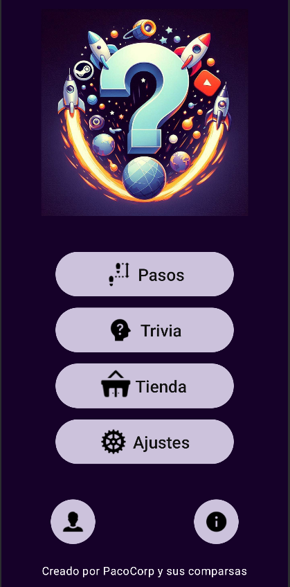
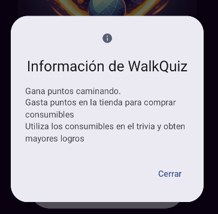
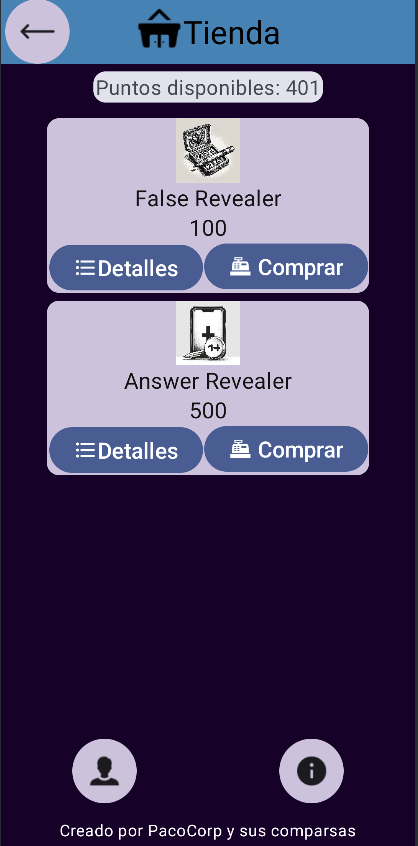
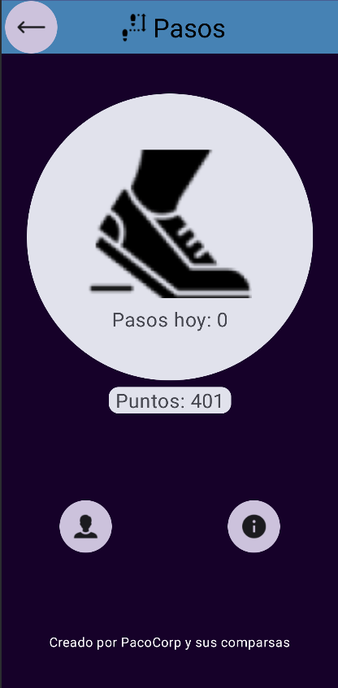
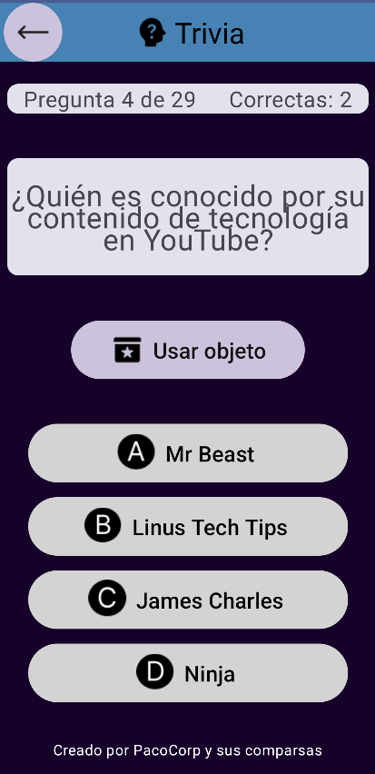
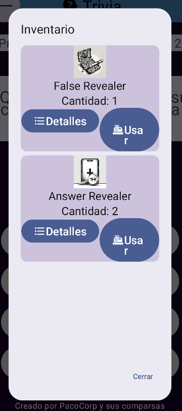
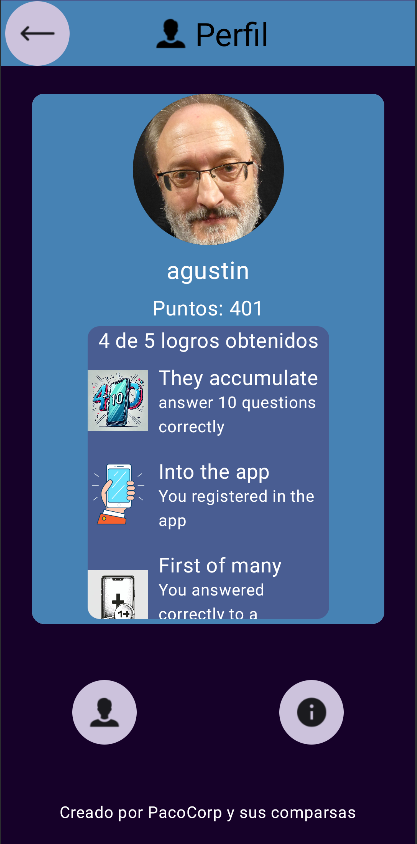

# WalkQuiz

## Introducción
La aplicación móvil propuesta, denominada provisionalmente **WalkQuiz**, es una innovadora herramienta de cuestionarios diseñada para atraer a los entusiastas de las redes sociales y los videojuegos y promocionar el ejercicio físico a través del contador de pasos del móvil.

## Objetivos
El objetivo principal de **WalkQuiz** es proporcionar una experiencia de aprendizaje y entretenimiento a través de cuestionarios temáticos creados por los desarrolladores, mientras se fomenta la actividad física mediante el uso del podómetro del móvil. 

**WalkQuiz** busca dar a sus usuarios un entorno que les permita encontrar una motivación para hacer ejercicio a través de una experiencia entretenida y dinámica, proporcionando una experiencia de juego que les haga realizar ejercicio a la par que demostrar y adquirir nuevos conocimientos.

## Diseño
### Inicio de sesión y registro
En primer lugar, en estas pantallas, el usuario iniciará sesión con sus credenciales para acceder a la aplicación (ver imagen 1) y, en caso de no estar registrados, podrá acceder al registro pulsando en el botón de la parte inferior. (ver imagen 2)

Imagen 1

Imagen 2

### Inicio
Una vez iniciada sesión, tenemos el diseño inicial para la página de inicio.  Aquí el usuario podrá decidir a qué parte de la aplicación acceder utilizando alguno de los 4 botones de la parte central. (ver imagen 3)

Imagen 3

### PopUp: Información o detalles
Si el usuario pulsa en el icono de “Información” de la parte inferior podrá ver un poco de información sobre la aplicación y aparecerá un “popup” con esta pantalla. (ver imagen 4) 

Imagen 4

### Tienda
Si, en la pantalla principal, el usuario pulsa el botón de la tienda accederá a una pantalla (ver imagen 5) en donde podrá comprar con los puntos obtenidos con el podómetro objetos ofertados. Dichos objetos estarán orientados a ayudar al usuario en el cuestionario. Adicionalmente si el usuario selecciona detalles en un objeto podrá ver detalles del objeto en un “popup” utilizando el estilo de la Imagen 4. (ver imagen 6) 

Imagen 5

Imagen 6

### Contador de pasos
Cuando el usuario seleccione el botón “Pasos” en la pantalla de inicio, accederá a una pantalla en la que podrá consultar los pasos realizados hoy, y su cantidad de puntos actualmente. Además, en esta pantalla se contarán los pasos que de mientras la mantenga abierta (ver imagen 7). 

Imagen 7

### Trivia

Cuando, en la pantalla principal, el usuario seleccione el botón “Trivia”, accederá a una pantalla en la que se le presentarán, de una en una, las preguntas que tendrá que responder. Se mostrarán el número de preguntas restantes y el número de preguntas acertadas, así como el texto de la pregunta y hasta cuatro opciones disponibles (ver imagen 8). Además, tendrá acceso a un botón para utilizar los objetos comprados en la tienda.  Al pulsar el botón “Usar objeto” se mostrará un pop-up al usuario en el que este podrá seleccionar alguno de los objetos comprados para utilizarlo durante la pregunta actual. (ver imagen 9) 

Imagen 8

Imagen 9

### Perfil

En esta pantalla el usuario podrá consultar su nombre de perfil, imagen, puntos y logros obtenidos. (ver imagen 10) 

Imagen 10

## Arquitectura

Para realizar este proyecto no hemos utilizado puramente una arquitectura. Hemos utilizado parcialmente arquitectura hexagonal. Tenemos, por un lado, un dominio y los repositorios de la capa de aplicación implementados en Java y, por otro, tenemos los adaptadores. El de Firebase también está implementado en Java y el de Kotlin está implementado en el propio lenguaje Kotlin. 

Además, como Jetpack Compose esta diseñado para funcionar con una arquitectura vista-modelo, en el propio adaptador de Kotlin tenemos un modelo más parecido a VMMV. Idealmente para obtener una arquitectura hexagonal pura solo habría que separar la lógica de los servicios (vista modelo) de las vistas y meterlo en la capa de aplicación. 

## Funcionalidades

En pocas palabras las funcionalidades que tiene nuestra aplicación son las siguientes: 

1. **Cuestionarios Temáticos**: Los desarrolladores crean y actualizan regularmente cuestionarios sobre redes sociales y videojuegos.
2. **Sistema de Logros**: Los usuarios pueden obtener logros que les motivan a seguir participando en los cuestionarios.
3. **Integración con Podómetro**: La aplicación cuenta los pasos del usuario y les otorga puntos que pueden canjear en una tienda virtual.
4. **Tienda Virtual**: Los usuarios pueden utilizar los puntos obtenidos para comprar consumibles y posiblemente objetos permanentes que les ayudan en los cuestionarios, como comodines que permiten al usuario evadir preguntas que les resulten dificiles. 

## Conclusiones

Tras desarrollar la aplicación propuesta hemos podido aprender mucho de como funciona Kotlin y a utilizar Jetpack Compose. Hemos aprendido a integrar tanto Java como Kotlin para poder crear productos en donde se separa lo que corresponde al dominio del resto de la aplicación. También pudimos aprender sobre los sensores del móvil, en este caso utilizamos el podómetro, que por desgracia no pudimos utilizar en el emulador de Android Studio, lo que dificulta un poco la labor de trabajar con él.